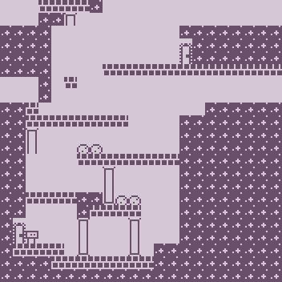

# Tielmaps

This is a foundation for a pixel platformer game playable on a computer (not a mobile device, currently).

- See the code on [Github][tm-github].
- Play what this compiles down to on [Github Pages][tm-ghpages].

Controls:

| key   | result         |
| ----- | -------------- |
| ← →   | Move sideways. |
| space | Jump.          |

Feel free to fork and make your own game!



## Introduction

I started this (still in-progress) project to sate my own curiosity. I wanted to learn more about the [Elm programming language][elm], and try making a web browser-runnable, barebones pixel platformer game basically from the ground up, while focusing only on its core elements.

I wanted to make this as self-contained as possible, so graphics are drawn using an 8 × 8 grid of “ASCII art” and then passed through a function that transforms it into structured data. Map screens are also designed in this same way. It's actually a really fun way of drawing the art and designing the levels, I think!

```
█ █ █ █ █ █ █ █
█ . . . . . . █
█ . . █ . █ . █
█ . . . . . . █
█ █ █ █ █ █ █ █
/ █ / / █ █ / /
█ █ / / / / █ /
/ / / / / / / /
```

I also went for a monochrome art style, wanting to reduce things to their minimal essence. The idea is not to make a complex game, just a technical foundation that could foreseeably be expanded upon.

So I hope that this is an easy to hack codebase, sensibly organized for easy comprehension. It's intended for people interested in making their own platformer, but who don't know where to start; game makers interested in Elm who want a working example; or programmers interested in purely functional, strongly-typed languages who want to see how a game could be structured under that paradigm.

I myself am learning through this process, so I don't claim I have the right approach, and it'll probably change as it moves forward. Feel welcome to fork and extend, or to send feedback this way!

— agj

[tm-github]: https://github.com/agj/tielmaps
[tm-ghpages]: https://agj.github.io/tielmaps/
[elm]: https://elm-lang.org/
[node]: https://nodejs.org/
[parcel]: https://parceljs.org/
[ts]: https://www.typescriptlang.org/
[elmjson]: https://github.com/elm/compiler/blob/master/docs/elm.json/application.md
[packagejson]: https://nodejs.org/en/knowledge/getting-started/npm/what-is-the-file-package-json/
[tsconfig]: https://www.typescriptlang.org/docs/handbook/tsconfig-json.html
[envvar]: https://en.wikipedia.org/wiki/Environment_variable
[elm-review]: https://github.com/jfmengels/elm-review

## The code

Here's the more important bits of the repo to check out:

- `source/`
  - `elm/` — Elm code.
    - `Main.elm` — The Elm entry point. **Start looking here!**
    - `Assets/` — Graphics and level maps used in the demo level.
    - `Main.d.ts` — TypeScript types declaration file. Just makes the Elm code more understandable to TypeScript code.
  - `ts/` — TypeScript code.
    - `index.ts` — Initializes stuff, including the Elm runtime.
    - `element.ts` — Custom element (also known as “web component”) that the Elm code uses to render pixels.
    - `types.ts` — TS type definitions.
  - `html/index.html` — The singular HTML file that holds all the other stuff.
- `elm.json` — [Elm configuration][elmjson]. Lists the packages this project depends on.
- `package.json` — [Node configuration][packagejson]. Mainly package dependencies and some scripts to aid in development (more about that in the following section).
- `ts-config.json` — [TypeScript configuration][tsconfig].

Some less relevant parts you can safely ignore:

- `tests/` — A few unit tests.
- `review/` — Linter ([elm-review][elm-review]) configuration. Set up as a separate Elm project.
- `benchmarks/` — Performance checks for some parts of the Elm code. Set up as a separate Elm project.
- `.env` — [Environment variables][envvar], specifically one that tells Parcel not to use the Elm debugger, because it sadly slows down this application due to its many events per second.

## Hack it

To start, you'll need [Node][node] 14 or higher installed.

After downloading or cloning this repository into your computer, go into that directory in a terminal and run `npm install`. This will install other dependencies, like the [Parcel][parcel] bundler.

The bulk of the code is written in [Elm][elm], but a bit of it is [TypeScript][ts] (just JavaScript with types).

Running the `npm run build` command will create the output HTML and JS files inside the `dist/` folder.

To develop, use the `npm run develop` command. It will allow you to see changes in your browser as you modify the files. After you run the command, and provided the code has no errors, a URL will get displayed, which you can then open in your browser to see the game live. To stop it, press ctrl+C in the terminal. After you make some big changes, you might need to refresh the browser.

Other (less important) commands are:

- `npm run test` to run unit tests.
- `npm run lint` to run some checks on code style.
- `npm run benchmark` to see some performance benchmarks.

## Unlicense

This is free and unencumbered software released into the public domain.

Anyone is free to copy, modify, publish, use, compile, sell, or
distribute this software, either in source code form or as a compiled
binary, for any purpose, commercial or non-commercial, and by any
means.

In jurisdictions that recognize copyright laws, the author or authors
of this software dedicate any and all copyright interest in the
software to the public domain. We make this dedication for the benefit
of the public at large and to the detriment of our heirs and
successors. We intend this dedication to be an overt act of
relinquishment in perpetuity of all present and future rights to this
software under copyright law.

THE SOFTWARE IS PROVIDED "AS IS", WITHOUT WARRANTY OF ANY KIND,
EXPRESS OR IMPLIED, INCLUDING BUT NOT LIMITED TO THE WARRANTIES OF
MERCHANTABILITY, FITNESS FOR A PARTICULAR PURPOSE AND NONINFRINGEMENT.
IN NO EVENT SHALL THE AUTHORS BE LIABLE FOR ANY CLAIM, DAMAGES OR
OTHER LIABILITY, WHETHER IN AN ACTION OF CONTRACT, TORT OR OTHERWISE,
ARISING FROM, OUT OF OR IN CONNECTION WITH THE SOFTWARE OR THE USE OR
OTHER DEALINGS IN THE SOFTWARE.

For more information, please refer to <http://unlicense.org/>
